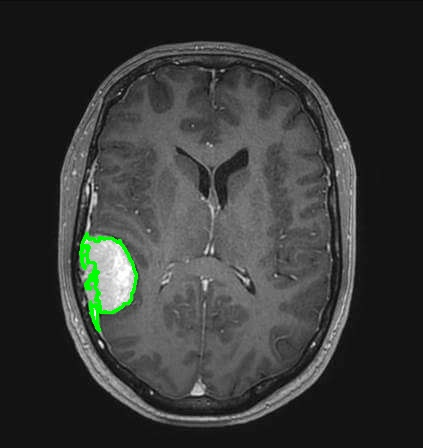
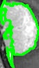
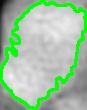
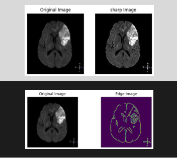
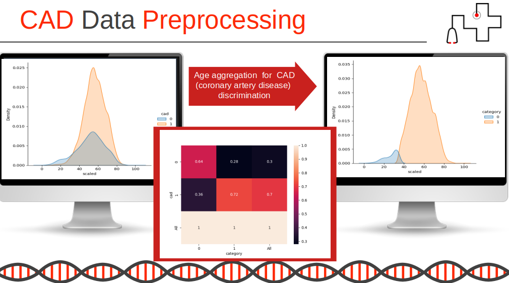
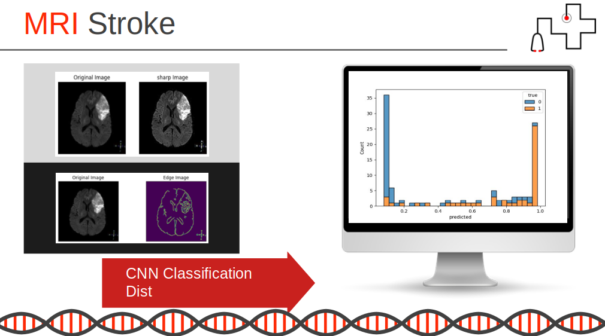
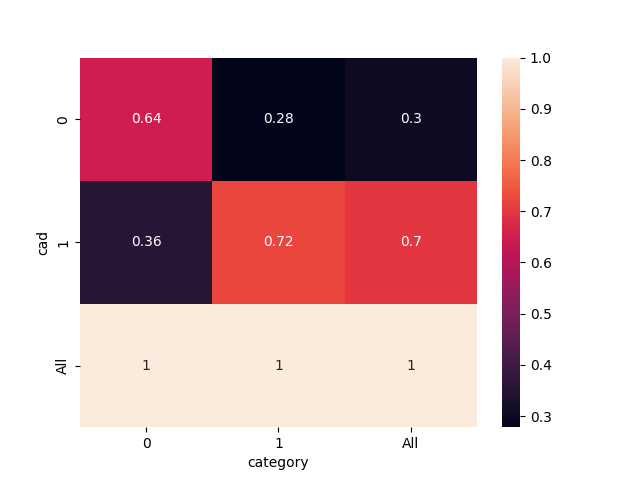

# github_portfolio

Ahlem Midini

Data Scientist 
- Medical Diagnosis AI Toolkit
- Medical Data Preprocessing Optimization
- MRI Processing for Illness Classification
- Technologies : Numpy, Pandas, TensorFlow, Scipy, Scikit-learn, Skimage, Opencv
### brain tumor extraction

### draw brain tumor extraction

### draw contour brain encyphalitis  

### mri diplaying brain anomalies 

### Age aggregation for cad 

### classification 

###  cad rates by age category using preprocessing

